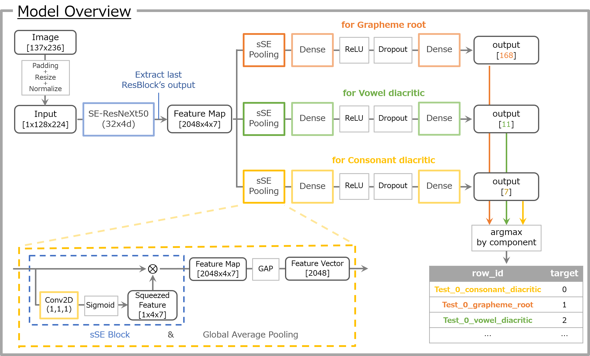

# Bengali.AI Handwritten Grapheme Classification
- This is the project for [Bengali.AI Handwritten Grapheme Classification](https://www.kaggle.com/c/bengaliai-cv19) hosted on Kaggle from 2019-12-20 to 2020-03-16.
- It finished at [10th place](https://www.kaggle.com/c/bengaliai-cv19/leaderboard) in the competition.

## Table of Contents

*   [Solution Overview](##solution-overview)
*   [Directory Layout](#directory-layout)
*   [How to Run](#how-to-run)
    *   [Requirements](#requirements)
    *   [Preparation](#preparation)
    *   [Training](#training)
    *   [Inference](#inference)
*   [License](#license)

## Solution Overview

You can find it on kaggle forum: `https://www.kaggle.com/c/bengaliai-cv19/discussion/136815`  
<br>
<div align="center">
  
</div>

## Directory layout

```
.
├── input
|     ├── bengaliai-cv19       # files provided by kaggle
|     └── chainercv-seresnext  # pre-trained SE-ResNeXt models
├── output                     # Where training and inference outputs are saved.
├── processed_data             # Where pre-processed inputs are saved.
└── src                        # Scripts to perform various tasks such as `preprocess`, `train`, `inference`
```


## How to run

Please make sure you run each of the scripts in `./src` directory.

### Requirements

The library versions used in this project. It does not mean other versions can not be used but not tested.

#### python & cuda
- Python 3.6.9
- CUDA 10.1 (CUDA driver 418.87)

#### Uusing python libraries
| Name           | Version |  
|:--------------:|:-------:|
| PyYAML         | 5.2     |
| scipy          | 1.4.1   |
| numpy          | 1.18.1  |
| pandas         | 0.25.3  |
| pyarrow        | 0.16.0  |
| scikit-learn   | 0.22.1  |
| matplotlib     | 3.1.2   |
| Pillow         | 6.2.1   |
| albumentations | 0.4.3   |
| chainer        | 7.1.0   |
| chainercv      | 0.13.1  |
| cupy-cuda101   | 7.1.0   |

#### hardware
* GPU: GTX1080Ti x 1

### Preparation

#### download competition dataset

Download [competition datasets](https://www.kaggle.com/c/bengaliai-cv19/data) in `./input/bengaliai-cv19/` directory and unzip there. You can do this easily using [kaggle api](https://github.com/Kaggle/kaggle-api). The example below is done in `./src` directory.

~~~
$ kaggle c download bengaliai-cv19 -p ../input/bengaliai-cv19/
$ unzip ../input/bengaliai-cv19/bengaliai-cv19.zip -d ../input/bengaliai-cv19/
~~~

#### download pre-trained models
Next, you have to download [chainercv pre-trained SE-ResNeXt models on ImageNet](https://www.kaggle.com/ttahara/chainercv-seresnext) in `./input/chainercv-seresnext` directory and unzip there. You can do this by one line using kaggle api.

~~~
$ kaggle d download ttahara/chainercv-seresnext -p ../input/chainercv-seresnext/ --unzip
~~~

#### pre-process competition data

In `./src` directory, run this.

~~~
$ python preprocess.py -tr -te
~~~

[preprocess.py](./src/preprocess.py) does the following at once.
  
- creates new directories for `.png` images : `./processed_data/train` and `./processed_data/test`
- convert `.parquet` files into `.png` images and save them in those directories.
- apply mult-label stratified group k-fold(k=4) to `train.csv` and save it as `./processed_data/train_add-4fold-index.csv` (but actually not used)
- reshape `test.csv` to the same format as `train.csv` and save it as `./processed_data/test_reshaped.csv`


### Training

In `./src` directory, run this.

~~~
$ python nn_train.py -s settings_final_model.yml -o ../output/00_SERX50sSE_128x224_3x35epoch_all_data
~~~

- `-s` : specifies a training settings file written by `YAML` format
- `-o` : specifies a directory to output training results(trained weights, log, copy of settings file, and so on).
    - The specified directory is newly created (if the same name directory exists, this program will quit).

### Inference

#### inference by single model.

In `./src` directory, run this. (The example below uses the model of 70 epoch.)

~~~
$ python nn_inference.py -t ../output/00_SERX50sSE_128x224_3x35epoch_all_data -o ../output/00_infer_by_epoch70 -e 70 -g 0 -bs 128
~~~

- `-t` : specifies a directory to output training results which includes trained weights for inference.
- `-o` : specifies a directory to output inference outputs
    - logits for each class (`shape: (n_test, n_class)`): numpy.ndarray saved as `.npy` file
    - prediction for each example by submission format: pandas.Dataframe saved as `.csv` file
    - The specified directory is newly created (if the same name directory exists, this program will quit).
- `-e` : specifies the epoch of model weights for inference
    - if corresponding file does not exist, use the model of last epoch
- `-g` : specifies a gpu device for inference.
- `-bs`: specifies batch size for inference loop


#### inference by snapshot ensemble

In `./src` directory, run this.

~~~
$ python nn_inference_by_snapshot_ensemble.py -t ../output/00_SERX50sSE_128x224_3x35epoch_all_data -o ../output/00_infer_by_snapshot_ensemble -g 0 -bs 128 
~~~

- `-t` : specifies a directory to output training results which includes trained weights for inference.
- `-o` : specifies a directory to output inference outputs
    - Logits for each class of all model(`shape: (n_model, n_test, n_class)`): numpy.ndarray saved as `.npy` file
    - Probs for each class(`shape: (n_test, n_class)`): numpy.ndarray saved as `.npy` file
    - prediction for each example by submission format: pandas.Dataframe saved as `.csv` file
    - The specified directory is newly created (if the same name directory exists, this program will quit).
- `-g` : specifies a gpu device for inference.
- `-bs`: specifies batch size for inference loop


## License

The license is MIT.